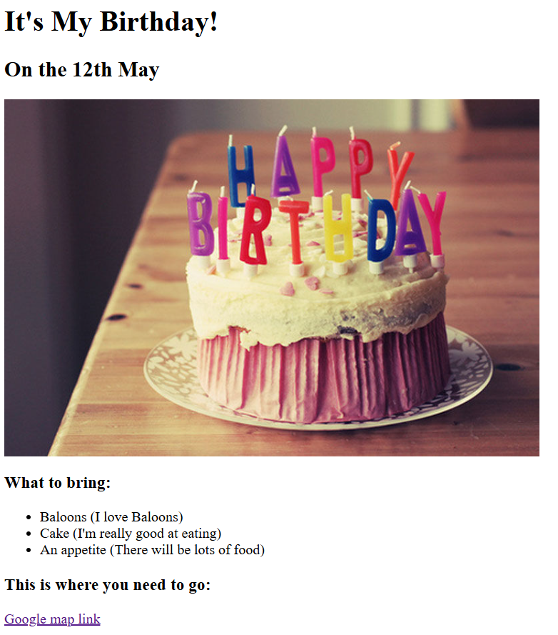

# Yugal's Portfolio

Welcome to my portfolio project! This repository showcases some of my projects and provides links to additional resources about me.

---

## 📖 **Description**

This portfolio is a collection of my work as a web developer. It highlights key projects I've worked on, including a **Movie Ranking Project** and a **Birthday Invitation Project**, along with links to learn more about me and contact me.

---

## 📂 **File Structure**

```
.
├── public/
│   ├── movie_rank.html         # Movie Ranking Project page
│   ├── birthday_invite.html    # Birthday Invitation Project page
│   ├── about.html              # About Me page
│   └── contact.html            # Contact Me page
├── assets/
│   └── images/
│       ├── Movie_ranking.png   # Screenshot of the Movie Ranking Project
│       └── Birthday_invitation.png  # Screenshot of the Birthday Invitation Project
└── index.html                  # Main Portfolio Page
```

---

## 🌟 **Projects Included**

### **1. Movie Ranking Project**
- **Description**: A web page that showcases a list of movies and allows users to rank them.
- **Preview**:  
  

### **2. Birthday Invitation Project**
- **Description**: A creative birthday invitation template designed with HTML and CSS.
- **Preview**:  
  

---

## 💻 **How to Run**

1. Clone the repository:
   ```bash
   git clone https://github.com/Yugal-kosamshile/portfolio.git
   cd portfolio
   ```

2. Open `index.html` in your web browser to view the main portfolio page.

3. Navigate through the links to explore individual projects or learn more about me.

---

## 🔗 **Live Preview**

You can also view this project live [here](#) (Add a link to your hosted portfolio, e.g., GitHub Pages, Netlify, etc.).

---

## 🤝 **Connect with Me**

- **LinkedIn**: [Yugal Kosamshile](https://www.linkedin.com/in/yugal-kosamshile-29a03a2)
- **GitHub**: [Yugal Kosamshile](https://github.com/Yugal-kosamshile)

---
